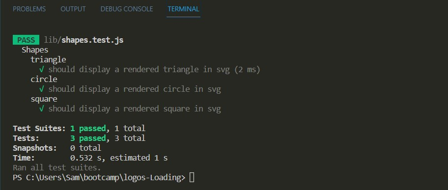

# Logos Loading

## Description 
  
In this Node.js application the user will provide inputs and this app will spit out logos for you.  Simple as that!
  
## Table of Contents 
  
- [Installation](#installation)
- [Usage](#usage)
- [Credits](#credits)
- [Features](#features)
- [Tests](#tests)
  
## Installation

Some installation packages is needed to run this application in command-line.

Please be sure to have the following installed prior to running this application:

-Install node version v16.18.0 by following instructions here:

https://coding-boot-camp.github.io/full-stack/nodejs/how-to-install-nodejs

-Install the inquirer, express and jest by running this in the terminal:

npm i inquirer@8.2.4

npm install express

npm i jest

Once these steps are completed run the index.js file to generate your logo!

## Usage
-Access application in terminal.

-type "node index.js" to start.

Please view the video demo link below to see how to use the application:

<a href="placeholder">Logos-Loading Video Demo</a>

    

## Credits
Node.js - https://nodejs.org/en/

EXPRESS - https://expressjs.com/en/starter/installing.html

SVG Documentation - https://developer.mozilla.org/en-US/docs/Web/SVG

Jest - https://jestjs.io/docs/getting-started

Inquirer - https://www.npmjs.com/package/inquirer

https://stackoverflow.com/

UW BOOTCAMP COURSE

Tutoring

## Features

Creates a simple logo using inputs recieved from user.

## Tests
  
After ensuring jest is installed by running "npm i jest" in terminal.  Then type "npm test shapes.test.js" to run a test on the shape renders.