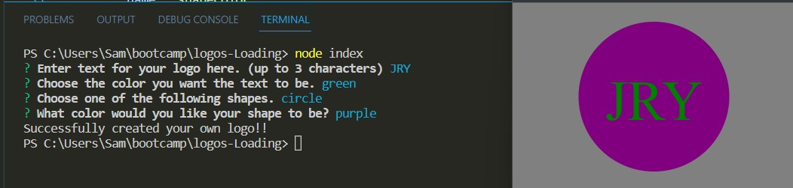

# Logos Loading

## Description 
  
In this Node.js application the user will provide inputs and this app will spit out logos for you.  Simple as that!
  
## Table of Contents 
  
- [Installation](#installation)
- [Usage](#usage)
- [Credits](#credits)
- [Features](#features)
- [Tests](#tests)
  
## Installation

Some installation packages is needed to run this application in command-line.

Please be sure to have the following installed prior to running this application:

-Install node version v16.18.0 by following instructions here:

https://coding-boot-camp.github.io/full-stack/nodejs/how-to-install-nodejs

-Install the inquirer, express and jest by running this in the terminal:

npm i inquirer@8.2.4

npm install express

npm i jest

Once these steps are completed run the index.js file to generate your logo!

## Usage

Please view the video demo link below to see how to use the application:

<a href="placeholder">Logos-Loading Video Demo</a>

    

## Credits
  
NA
  
## License

This project is licensed under the Apache 2.0 license.

https://www.apache.org/licenses/LICENSE-2.0.txt

## Features

creates readme using user inputs.

## Contributions

N/A

## Tests
  
N/A